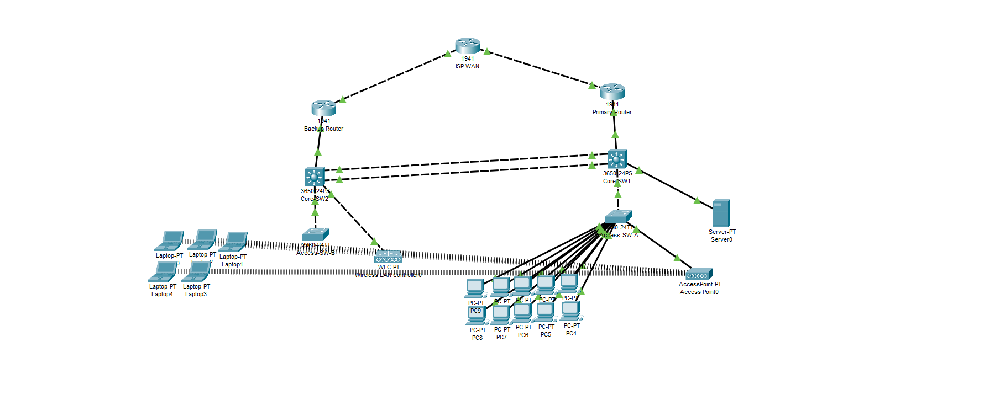

# 🏠 SOHO Network Setup with Redundancy & Security  

**Skills:** Azure · Networking · Cisco · Security

---

## 📌 Project Overview  
Configured a secure, redundant Small Office/Home Office (SOHO) network designed for high availability, segmentation, and security.  

**Core Features:**
- HSRP for gateway redundancy  
- EtherChannel (LACP) for switch resiliency  
- VLAN segmentation (Staff, Guest, & Management)  
- Security: ACLs, & Port Security
- Wireless: WPA2-Enterprise & Guest Wi-Fi  

## 🔧 Key Features Implemented

1️⃣ Network Redundancy & Resiliency

### ✔ HSRP/VRRP  
- Primary (R1) & Backup (R2) routers for default gateway failover  
- Virtual IPs:  
  - `192.168.10.254` (VLAN 10)  
  - `192.168.30.254` (VLAN 30)  
- **Command:**  
  show standby brief

  ✔ EtherChannel (LACP)
- Core SW1 ↔ Core SW2 (2x Gigabit links aggregated)
- Command:
show etherchannel summary

 VLAN Segmentation & Inter-VLAN Routing
✔ VLANs
| VLAN | Purpose | Subnet | 
| 10 | Staff LAN | 192.168.10.0/24 | 
| 30 | Guest Wi-Fi | 192.168.30.0/24 | 
| 99 | Management | 192.168.99.0/24 | 

✔ Router-on-a-Stick
- Subinterfaces on R1/R2 for VLAN routing
- Command:
show interface trunk

✔ DHCP Scopes
- Configured on router/server per VLAN
- Example:
ip dhcp pool STAFF
   network 192.168.10.0 255.255.255.0
   default-router 192.168.10.254

   ✔ Port Security
- Restricts MAC addresses per switch port
- Command:
interface fa0/1
  switchport port-security max 2
  switchport port-security violation restrict

  ✔ ACLs
- Block Guest (VLAN 30) from Staff (VLAN 10)
access-list 100 deny ip 192.168.30.0 0.0.0.255 192.168.10.0 0.0.0.255
access-list 100 permit ip any any

Wireless (Staff & Guest Wi-Fi)
✔ Staff Wi-Fi
- SSID: Office_Staff
- Security: WPA2-Enterprise (RADIUS)
- VLAN: 10
✔ Guest Wi-Fi
- SSID: Office_Guest
- Security: WPA2-Personal
- VLAN: 30
- Client Isolation: ON

