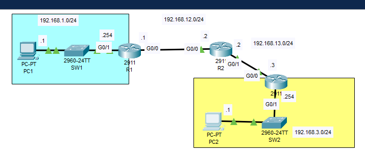

# 🛠️ Case Study: PC1–PC2 Ping Failure – Static Routing Troubleshooting

**📅 Date Logged:** July 2023
**🧑‍💻 Technician:** Nhlanhla Mkhithi  
**🔧 Toolset:** Cisco Packet Tracer, Static Routing, Network Engineer Troubleshooting

---

## 🧵 Scenario Context

During a LAN provisioning exercise simulating a mid-size business, two PCs representing departments (Sales & Finance) failed to communicate over a segmented network:

- **PC1 (Sales Zone):** 192.168.1.1  
- **PC2 (Finance Zone):** 192.168.3.1  
- **Transit Subnet (Router Interlink):** 192.168.12.0/24

Despite successful IP configuration and hostname updates for all endpoints and network devices, PC1 was unable to reach PC2 via ICMP (ping).

### 📸 Connection Topology Snapshot



---

## 🧠 Root Cause Analysis

### 🔎 Diagnostics Performed
- **IP Validation:** All endpoints configured correctly with static IPs  
- **Routing Table Review:**  
  - `R1` missing route to PC2's subnet (`192.168.3.0/24`)  
  - `R2` missing route to PC1's subnet (`192.168.1.0/24`)  
- **Tracepath/Ping Tests:** Failed at router hop – packets dropped due to lack of route  
- **Interface Checks:** Interfaces active, but static routes not declared

---

## 🛠️ Resolution Steps

### 👨‍🔧 Commands Applied
```bash
R1(config)# ip route 192.168.3.0 255.255.255.0 192.168.12.2   
R2(config)# ip route 192.168.1.0 255.255.255.0 192.168.12.1

### 📸 R1 Configuration of the Static Route 

 
### 📸 R2 Configuration of the Static Route  


### 📸 Ping Test – Before & After Static Route Fix  


- Normalized subnet masks
- Verified all interfaces up and correct
- Rebooted PC1 & PC2 flush ARP/DNS cache if needed

✅ Outcome
- Ping between PC1 and PC2 now succeeds
- Static route inspection confirms bidirectional paths

## 📂 Case Artifacts

Below are visual and configuration artifacts supporting the static routing troubleshooting between PC1 and PC2.

| Artifact 📸 | Description 🧾 | Link 🔗 |
|------------|----------------|--------|
| 🗺️ Topology Overview | Snapshot of full network layout | [images/Static_routes](https://github.com/MkhithiAzureNet/Mkhithiazurenet/blob/main/casebook/images/Static_routes.png) |
| 🧮 R1 Routing Config | Static route declaration to reach PC2 subnet | [images/R1_static_route_config](https://github.com/MkhithiAzureNet/Mkhithiazurenet/blob/main/casebook/images/R1_static_route_config.png) |
| 🧮 R2 Routing Config | Static route declaration to reach PC1 subnet | [images/R2_static_route_config](https://github.com/MkhithiAzureNet/Mkhithiazurenet/blob/main/casebook/images/R2_static_route_config.png) |
| 📊 Ping Results | ICMP test showing failure and success before/after route fix | [images/Ping_test_fail_pass](https://github.com/MkhithiAzureNet/Mkhithiazurenet/blob/main/casebook/images/Ping_test_fail_pass.png) |

---

**🔍 Tip:** These can be referenced individually for escalations, reproducibility in labs, or training Tier 1 techs on route logic and ICMP validation.

